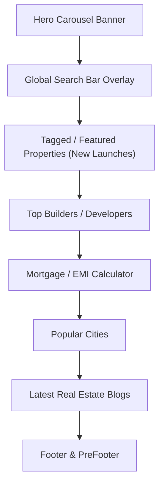
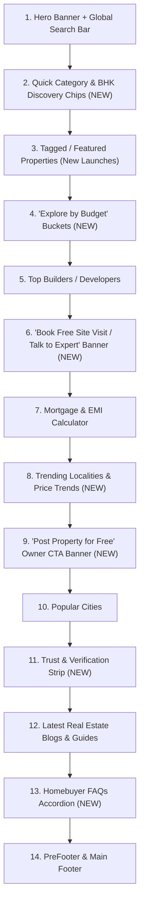

# Real Estate Portal Homepage Competitor Study & Gap Analysis
**Target Platform:** JUSTFLIP (`JUSTFLIP_NEXT`)  
**Benchmarked Competitors:** Housing.com, 99acres, Magicbricks, Square Yards, PropertyFinder, Zillow  
**Date:** August 2026  

---

## 1. Executive Summary

This document presents a comparative analysis between **JUSTFLIP** and leading property discovery portals in the Indian and international real estate markets (India & Dubai). 

While JUSTFLIP currently delivers a solid baseline experience (Hero Banner Search, Featured Properties, Top Builders, Mortgage Calculator, Popular Cities, and Blogs), there are critical feature and conversion gaps in:
1. **Quick-Action Discovery** (1-tap BHK and property-type shortcuts)
2. **Budget-Driven Exploration** (Frictionless price-bucket navigation)
3. **Supply-Side Acquisition** ("Post Property for Free" CTA for owners & brokers)
4. **Lead Generation & High-Intent Conversion** ("Book Free Site Visit" & Expert Advisor prompts)
5. **Trust & Credibility Signals** (RERA verification badges & Zero-Brokerage guarantees)
6. **Market Insights** (Locality price trends & YoY appreciation metrics)

Implementing these modules will improve user session duration, search click-through rates (CTR), seller listing volume, and qualified buyer lead generation.

---

## 2. Current JUSTFLIP Homepage Audit

The current homepage flow (`src/app/(home)/page.tsx`) consists of the following components:

### Strengths
- Clean visual layout with responsive SSR & deferred data hydration.
- Built-in mortgage calculator directly on the homepage for financial estimation.
- City and builder showcases established.

### Current Limitations
- **Buyer-Only Focus:** No entry point for sellers, landlords, or channel partners to post inventory.
- **Search-Bar Dependency:** Users must manually search or browse large carousels rather than using 1-tap intent filters (BHK, Budget, Ready-to-Move).
- **Passive Discovery:** No clear high-intent call-to-action (e.g., Free Site Visit, Property Consultation, WhatsApp Connect).
- **Missing Trust Elements:** No prominent RERA or verification strip on the homepage to alleviate buyer skepticism.

---

## 3. Competitor Benchmarking Matrix

| Homepage Feature / Module | Housing.com | 99acres | Magicbricks | Square Yards | PropertyFinder | JUSTFLIP (Current) | Priority |
| :--- | :---: | :---: | :---: | :---: | :---: | :---: | :---: |
| **Hero Carousel & Search Bar** | ✅ | ✅ | ✅ | ✅ | ✅ | ✅ | **Present** |
| **Featured Projects / New Launches** | ✅ | ✅ | ✅ | ✅ | ✅ | ✅ | **Present** |
| **Top Developer Logos / Cards** | ✅ | ✅ | ✅ | ✅ | ✅ | ✅ | **Present** |
| **Mortgage / EMI Calculator** | ✅ | ✅ | ✅ | ✅ | ✅ | ✅ | **Present** |
| **Popular Cities Grid** | ✅ | ✅ | ✅ | ✅ | ✅ | ✅ | **Present** |
| **Real Estate Blogs / Articles** | ✅ | ✅ | ✅ | ✅ | ✅ | ✅ | **Present** |
| **"Post Property Free" (Supply Acquisition)** | ✅ | ✅ | ✅ | ✅ | ✅ | ❌ | **P0 (Critical)** |
| **1-Tap Category & BHK Chips** | ✅ | ✅ | ✅ | ✅ | ✅ | ❌ | **P0 (Critical)** |
| **"Explore by Budget" Price Buckets** | ✅ | ✅ | ✅ | ❌ | ✅ | ❌ | **P0 (Critical)** |
| **"Book Site Visit / Talk to Expert" Banner** | ❌ | ❌ | ❌ | ✅ | ✅ | ❌ | **P1 (High)** |
| **Trust & Verification Strip (RERA / 0% Brokerage)** | ✅ | ✅ | ✅ | ✅ | ✅ | ❌ | **P1 (High)** |
| **Trending Localities & Price/Sq.Ft Snapshot** | ✅ | ✅ | ✅ | ✅ | ❌ | ❌ | **P1 (High)** |
| **Curated Lifestyle Collections** | ✅ | ✅ | ✅ | ✅ | ✅ | ❌ | **P2 (Medium)** |
| **Homebuyer FAQs Accordion (SEO & Trust)** | ✅ | ✅ | ✅ | ❌ | ❌ | ❌ | **P2 (Medium)** |

---

## 4. In-Depth Breakdown of Missing Modules

### 4.1. Quick Category & BHK Discovery Chips (P0)
* **Rationale:** Over 60% of mobile users avoid typing in search bars. They prefer 1-tap navigation chips positioned immediately below the hero search bar.
* **Suggested Chips:**
  - `2 BHK Apartments`
  - `3 BHK Apartments`
  - `Independent Villas`
  - `Plots & Land`
  - `Ready to Move In`
  - `Commercial & Retail`
* **Target Action:** Direct links to `/search?type=apartment&bhk=2`, etc.

---

### 4.2. "Explore by Budget" Buckets (P0)
* **Rationale:** In real estate, budget is the primary search filter. Providing pre-curated price bands drastically accelerates listing discovery.
* **Suggested Bands (Localized for INR / AED):**
  - **Under ₹50 Lakhs** *(Affordable Housing)*
  - **₹50 Lakhs – ₹1 Crore** *(Mid-Segment)*
  - **₹1 Crore – ₹2.5 Crores** *(Premium)*
  - **₹2.5 Crores+ / Luxury** *(High-Net-Worth)*

---

### 4.3. "Post Property for FREE" Seller / Broker Banner (P0)
* **Rationale:** A successful property portal requires constant fresh supply from individual owners, brokers, and developers.
* **Implementation:** High-contrast, appealing banner placed mid-page:
  - *Headline:* "Are you a Property Owner or Broker?"
  - *Subtext:* "List your property on JustFlip for free and reach 50,000+ verified buyers."
  - *CTA Button:* "Post Property — 100% Free" (linking to `/post-property`).

---

### 4.4. High-Intent Lead Magnet: "Book Free Site Visit / Expert Advice" (P1)
* **Rationale:** Adopted heavily by high-conversion platforms (Square Yards, Anarock, PropTiger). Real estate is an assisted buying journey.
* **Value Proposition:**
  - Free site visit cab arrangement / virtual walkthrough assistance.
  - 1-on-1 unbiased advice on RERA approvals and developer reputation.
  - Instant 1-click WhatsApp or Phone consultation modal.

---

### 4.5. Trust & Verification Strip (P1)
* **Rationale:** Buying property is one of the highest-value transactions in a consumer's lifetime. Visual trust guarantees immediately lower bounce rates.
* **Core Value Props:**
  1. 🛡️ **100% RERA Verified:** Every listed project verified with official state regulatory authorities.
  2. 💰 **0% Brokerage on New Launches:** Direct developer inventory and guaranteed price transparency.
  3. ⚖️ **Legal & Title Assistance:** Full due diligence support on ownership titles and builder approvals.
  4. 🤝 **End-to-End Handholding:** Site visit coordination to final registration support.

---

### 4.6. Trending Localities & Average Price Trends (P1)
* **Rationale:** Buyers want to know where capital appreciation and rental yields are highest before investing.
* **Component Design:** Cards displaying top micro-markets (e.g. *Whitefield (Bengaluru)*, *Golf Course Ext. (Gurugram)*, *Business Bay (Dubai)*) with:
  - Average Price per Sq. Ft.
  - Year-over-Year (YoY) Growth indicator (e.g., `+12.8% YoY`).
  - Active available properties count.

---

### 4.7. Homebuyer FAQs Accordion (P2)
* **Rationale:** Enhances on-page SEO via Google FAQ Schema (`FAQPage`) and answers key buyer concerns directly on the homepage.
* **Sample Topics:**
  - *How does JustFlip verify project RERA registration?*
  - *What documents are needed to book a new launch apartment?*
  - *Can NRIs purchase property in India/Dubai through JustFlip?*
  - *How do home loan interest deductions and tax benefits work?*

---

## 5. Recommended Homepage Architecture

Below is the optimized top-to-bottom layout for maximum conversion, discoverability, and SEO:

---

## 6. Phased Implementation Roadmap

### Phase 1: High-Impact Quick Wins (P0)
1. **Quick Category & BHK Filter Bar**: Simple, lightweight horizontal chip bar under the search banner.
2. **"Post Property for FREE" Banner**: Connect to existing `/post-property` route to begin acquiring supply.
3. **"Explore by Budget" Section**: 4 clickable budget cards routing to search filter queries.

### Phase 2: Lead Generation & Trust (P1)
1. **"Book Free Site Visit / Talk to Expert" Banner**: Form / modal integration for capturing phone/WhatsApp leads.
2. **Trust & Verification Strip**: 4-point icon badge row placed above or below builder listings.
3. **Trending Localities Snapshot**: Card list of top 4-6 micro-markets with avg ₹/sq.ft and % growth.

### Phase 3: SEO & Market Insights (P2)
1. **Homebuyer FAQs Accordion**: Expandable Q&A section with `FAQPage` JSON-LD schema.
2. **Curated Lifestyle Collections**: "Near Metro", "Lake Facing", "Gated Communities" thematic carousels.
